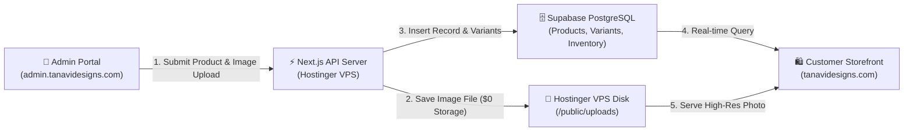

# 📖 Tanavi Studio Admin Guide: Product Management, Inventory & Storefront Mapping

This master operational guide explains step-by-step how to add designer products, manage stock quantities and prices in the **Tanavi Studio Admin Portal**, and how each setting maps directly to your live **Tanavi by Deepika** customer storefront.

---

## 🔄 End-to-End Data Flow Architecture

When you create or update a product in the Admin Portal, the data flows instantaneously across your system:

---

## 📸 1. Adding a New Product (Admin Portal)

### 🔗 Portal URL: `https://admin.tanavidesigns.com/admin/products/new`

### Form Fields & Instructions

| Field Name | Example Input | Description & Function |
| :--- | :--- | :--- |
| **Product Title** | `Meera Chanderi Anarkali Set` | Main title displayed everywhere across the storefront. Automatically generates the URL Slug and base SKU code. |
| **URL Slug** | `meera-chanderi-anarkali-set` | The permanent Web URL for the product page: `https://tanavidesigns.com/products/meera-chanderi-anarkali-set`. |
| **SKU Code** | `TNV-MEERA-26` | Unique stock-keeping unit identifier for internal studio tracking and invoice generation. |
| **Base Price (INR ₹)** | `2450` | Selling price in Indian Rupees. Stored in paise (`245000`) for precision calculations. |
| **Status** | `Active (Published)` | **Active**: Visible on storefront & searchable. **Draft**: Hidden from customers, saved for studio preview. |
| **Fabric** | `Handloom Silk Chanderi` | Fabric composition shown on customer Product Detail Page (PDP). |
| **Craft / Technique** | `Gota Patti & Hand Embroidery` | Traditional craft details displayed as artisanal badges on PDP. |
| **Product Photo** | `📁 Upload Image File` | Upload JPG, PNG, or WebP photo directly from laptop/mobile. Stored on your **Hostinger VPS Disk** (`/uploads/...`) with **$0 storage fees**. |
| **Description** | `Hand-finished silhouette...` | Rich garment details, weave specifications, care instructions, and dupatta details. |

> [!TIP]
> **Hostinger Disk Storage Advantage**: Uploaded photos are stored directly on your 100GB Hostinger VPS SSD drive in persistent Docker volume `tanavi_uploads`. You never pay extra Supabase storage fees.

---

## 📦 2. Managing Inventory & Stock Quantities

### 🔗 Portal URL: `https://admin.tanavidesigns.com/admin/inventory`

### How Stock Quantities Work:

1. **Automatic Variant Creation**:
   When a product is created, 3 default size variants (**Small - S**, **Medium - M**, **Large - L**) are initialized automatically in Supabase database with default quantity on hand = **5 units per size**.

2. **Inventory Control Ledger**:
   - **Quantity on Hand (QoH)**: Actual physical stock count available in your studio.
   - **Quantity Reserved**: Units temporarily held during customer online checkout (released after 15 minutes if unpaid).
   - **Low Stock Threshold**: Triggers a **Low Stock Alert** in Admin Overview when inventory drops below 2 units.

3. **Stock Adjustments**:
   You can update variant stock counts directly at any time by clicking **+ Stock** or **- Stock** on `https://admin.tanavidesigns.com/admin/inventory`.

---

## 🛍️ 3. How Products Appear in Customer Storefront

### Storefront Section Mapping Table

| Admin Field | Where It Appears on Customer Storefront | Customer Portal URL |
| :--- | :--- | :--- |
| **Published Status = Active** | Main Shop Catalogue Grid & Search Results | `https://tanavidesigns.com/shop` |
| **Category Slug (`kurta-sets`)** | Category Filtered Page | `https://tanavidesigns.com/category/kurta-sets` |
| **Collection Tag (`new-arrivals`)** | New Arrivals Edit Page & Homepage Carousel | `https://tanavidesigns.com/collections/new-arrivals` |
| **Title, Price & Uploaded Photo** | Product Card on Catalogue Grid | `https://tanavidesigns.com/shop` |
| **Fabric & Craft Badges** | Artisanal badges & specifications on PDP | `https://tanavidesigns.com/products/[slug]` |
| **Variant Stock Quantities** | Size Selector buttons (**S**, **M**, **L**). If stock = 0, size button shows **"Sold Out"** | `https://tanavidesigns.com/products/[slug]` |

---

## 🚀 Quick Checklist for Admin Team

1. Go to **`https://admin.tanavidesigns.com/admin/products/new`**.
2. Type **Title** (e.g. `Meera Chanderi Anarkali Set`) and **Price** (e.g. `2450`).
3. Click **`📁 Upload Image File from Device`** and select product photo.
4. Click **Publish Product to Store**.
5. Check stock quantities at **`https://admin.tanavidesigns.com/admin/inventory`**.
6. View published product live on storefront at **`https://tanavidesigns.com/shop`** or **`https://tanavidesigns.com/category/kurta-sets`**!
